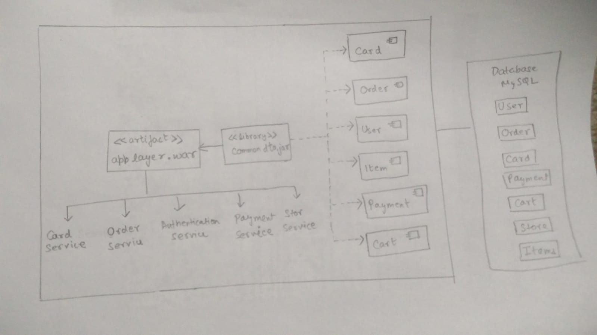
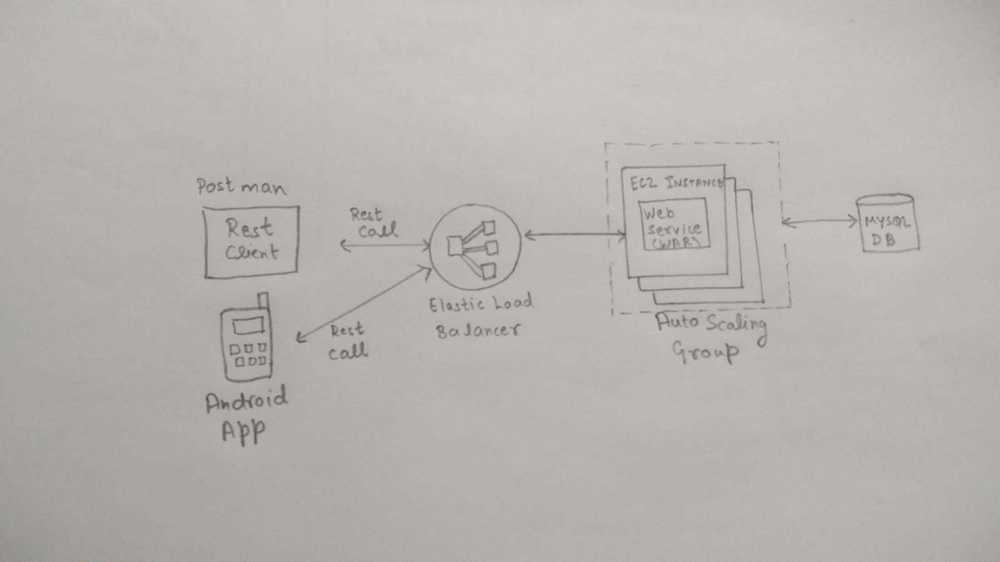
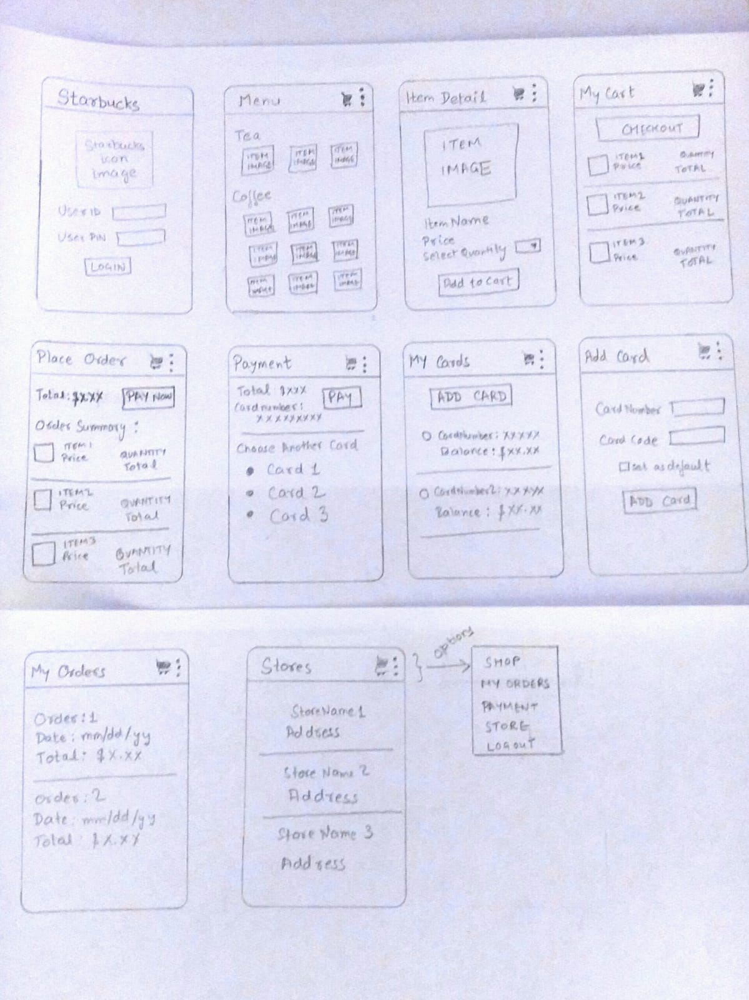

# su18-202-stellar

Sprint Task Sheet:
https://drive.google.com/file/d/15FNUplI05PNW0B8b8Wsb0ud1Qpa8E0_P/view?usp=sharing

### Team Name- STELLAR
Team Members - Anjana Eldo, Anjana Kamath, Mudrita Chaturvedi, Vidya Coimbatore Nand Kumar

###  A summary of areas of contributions (for each team member)
        • Anjana Eldo-  Add Card, view card, delete card, set-default card functionality. Implemented Load Balancer.
        • Anjana Kamath - User Authentication, Stores- view stores, Implemented Auto Scaling.
        • Mudrita Chaturvedi - Payments - add payment method, place order , Android App, set up EC2.
        • Vidya Coimbatore Nand Kumar - Order- view orders, add cart , view cart , RDS database setup.
        • Link to team's GitHub Repo- https://github.com/nguyensjsu/su18-202-stellar
        • Link to your team's Project Board (on GitHub) - https://github.com/nguyensjsu/su18-202-stellar/projects/1
        • Link to your team's Project Journal (on GitHub) - https://github.com/nguyensjsu/su18-202-stellar/blob/master/XPCoreValues-Communication
        • Link to your team's Google Sprint Task Sheet - https://drive.google.com/file/d/15FNUplI05PNW0B8b8Wsb0ud1Qpa8E0_P/view
        
The project implements MVC design pattern.
#### Model 
Model specifies the strcuture of the application. A domain notifies its views whenever the model changes.
#### View 
View represents the UI strcuture of the application. 
#### Controller 
Controller provides an interface between the model and views.
        
## Component Diagram

            
## EC2 Deployment Diagram

## UI Wireframes Diagram

